# Orpheus Turkish TTS Fine-Tuning with LoRA

Fine-tune [Orpheus-3B](https://huggingface.co/unsloth/orpheus-3b-0.1-pretrained) for **Turkish text-to-speech** with LoRA and Kubeflow Trainer v2 on Red Hat OpenShift AI.

## Overview

Orpheus-3B is a 3.3B-parameter codec language model (Llama-3 backbone) that generates speech as discrete SNAC audio tokens. The pretrained checkpoint is English-oriented. This example fine-tunes it on Turkish text–audio pairs so it produces intelligible Turkish speech.

### Key features

| Feature | Description |
| --- | --- |
| **LoRA fine-tuning** | Multi-node PyTorch DDP via `TransformersTrainer` |
| **Progress tracking** | Live steps, epochs, loss, and ETA in the OpenShift AI Jobs dashboard |
| **JIT checkpointing** | Pause-safe / preemption-safe saves to the shared PVC; auto-resume on restart |
| **Kueue scheduling** | TrainJobs admitted and queued through Kueue |
| **MLflow tracking** | Loss, in-training WAV samples, and Whisper WER/CER via RHOAI platform MLflow |
| **Post-training inference** | Load base model + LoRA adapter in the workbench (no weight merge) |

> [!IMPORTANT]
> Tested with OpenShift AI 3.4 and 3.5 with Kubeflow Trainer v2 on NVIDIA A100-80GB.
> On different GPUs, adjust `batch_size`, `grad_accum`, and `resources_per_node` in the notebook.

### How it works

```text
Turkish text
    → tokenize (Llama-3 vocabulary)
    → Orpheus-3B + LoRA  (predicts SNAC audio tokens)
    → SNAC decoder (24 kHz)
    → speech waveform
```

During fine-tuning, each example is a single sequence of Turkish text tokens followed by SNAC audio tokens. Loss is computed only on audio positions. At inference, load the pretrained base weights plus the LoRA adapter; the model emits SNAC tokens and the SNAC decoder produces a 24 kHz waveform.

### Model and dataset

| Component | Details |
| --- | --- |
| **Base model** | [unsloth/orpheus-3b-0.1-pretrained](https://huggingface.co/unsloth/orpheus-3b-0.1-pretrained) |
| **Audio codec** | [hubertsiuzdak/snac_24khz](https://huggingface.co/hubertsiuzdak/snac_24khz) |
| **Dataset** | [afkfatih/turkish-tts-combined-raw](https://huggingface.co/datasets/afkfatih/turkish-tts-combined-raw) (~81K pairs) |
| **Fine-tuning** | LoRA on attention + MLP projections (notebook default: r=64, α=128) |

## Requirements

### OpenShift AI cluster

* Red Hat OpenShift AI (RHOAI) 3.4 or 3.5 with `dashboard`, `trainer`, `workbenches`, and `mlflowoperator` enabled
* An `MLflow` CR deployed — see [Install and configure MLflow](https://docs.redhat.com/en/documentation/red_hat_openshift_ai_self-managed/3.5/html/working_with_mlflow/installing-mlflow_mlflow)
* At least 2 GPU worker nodes with 2 GPUs each (A100 recommended; set `gpus_per_node: 1` for single-GPU nodes)
* A storage class that supports **ReadWriteMany (RWX)** PVCs and **non-root / `fsGroup` writes**

### Hardware

#### Workbench

| Image | GPU | CPU | Memory | Notes |
| --- | --- | --- | --- | --- |
| Training \| Jupyter \| PyTorch \| CUDA \| Python | 1× GPU | 4 cores | 32Gi | GPU required for post-training inference |

#### Training job (notebook defaults)

| Component | Nodes × GPUs | CPU / pod | Memory / pod |
| --- | --- | --- | --- |
| TrainJob pods | 2 × 2 | 4 cores | 32Gi |

> [!NOTE]
> For GPUs with less than ~40 GiB VRAM, set `batch_size: 1` first, then raise `grad_accum` if you want a similar effective batch. `grad_accum` alone does not reduce peak VRAM. You can also set `gpus_per_node: 1`.

#### Storage

| Purpose | Size | Access mode | Notes |
| --- | --- | --- | --- |
| PVC named `shared` | 150 GiB recommended (60 GiB minimum) | RWX | Must be writable from the workbench |

Layout (created automatically by `train_func` at runtime):

```text
shared/orpheus-tts/
  hf-cache/
  preprocessed/     # SNAC cache + .done-<hash> sentinel
  checkpoints/      # LoRA adapters (use checkpoints/final for inference)
  logs/
  tensorboard/
```

| Where | Path |
| --- | --- |
| Workbench | `/opt/app-root/src/shared` |
| TrainJob pods | `/mnt/kubeflow-checkpoints` (same PVC; SDK mount) |

## Environment variables

Usually auto-set in OpenShift AI workbenches:

| Variable | Required | Description |
| --- | --- | --- |
| `OPENSHIFT_API_URL` | Yes | OpenShift API server URL |
| `NOTEBOOK_USER_TOKEN` | Yes | User token for API access (`oc whoami -t` if unset) |
| `MLFLOW_TRACKING_URI` | Auto | Auto-injected when the workbench has the `opendatahub.io/mlflow-instance` annotation |
| `MLFLOW_TRACKING_AUTH` | Auto | Set to `kubernetes-namespaced` by the platform; training pods inherit this |

If the API URL or token is missing, uncomment and fill them in the notebook auth cell. MLflow environment variables are automatically configured when the MLflow Operator is enabled — see [Track experiments in workbenches](https://docs.redhat.com/en/documentation/red_hat_openshift_ai_self-managed/3.5/html/working_with_mlflow/tracking-experiments-with-mlflow-in-workbenches).

## Setup

### 1. Create a Data Science Project

In the OpenShift AI dashboard, open **Data Science Projects** and create a project. You will set this name as `namespace` in the notebook.

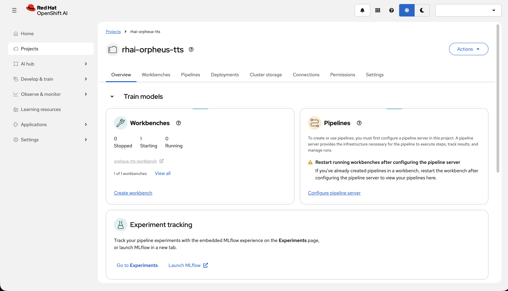

### 2. Create a workbench

Use the **Training | Jupyter | PyTorch | CUDA | Python** image and a hardware profile with a **GPU** and enough memory (**4 CPU / 32 GiB** for inference):

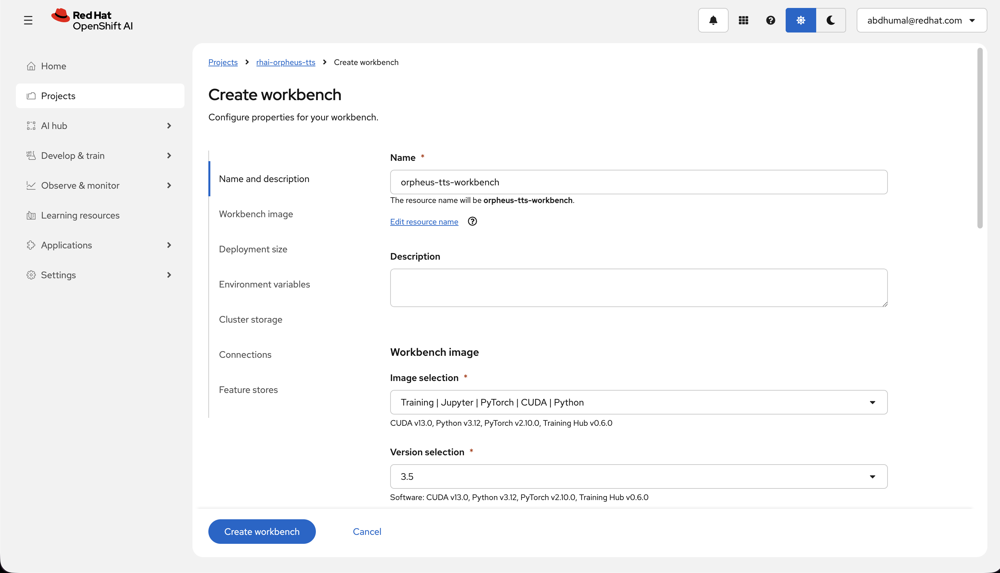

### 3. Attach shared storage (RWX)

Create a PVC named **`shared`** with **RWX** access (60 GiB minimum; 150 GiB recommended). Mount it on the workbench at **`/opt/app-root/src/shared`**:

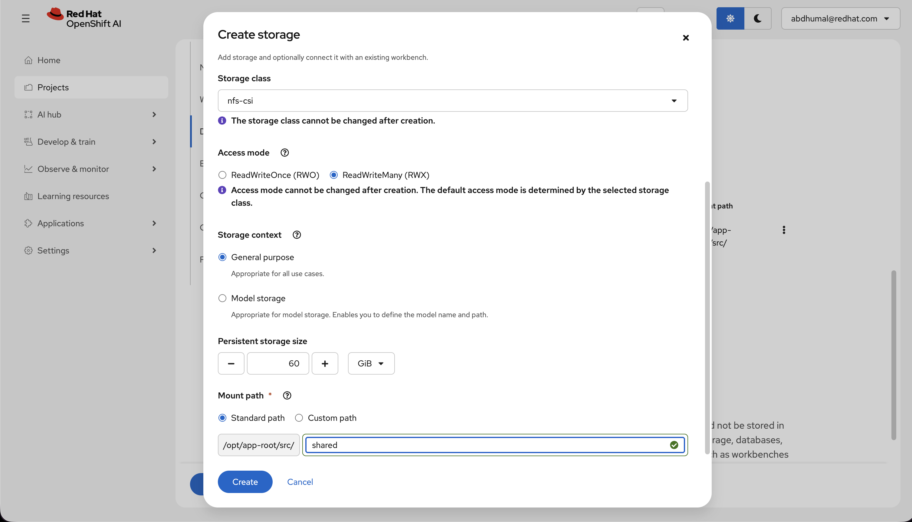

> [!NOTE]
> Choose a storage class that allows non-root / `fsGroup` writes. If the workbench cannot create files under `/opt/app-root/src/shared`, fix storage before training (see [Troubleshooting](#permission-denied-on-the-shared-pvc)).

When the workbench is **Running**, open it:

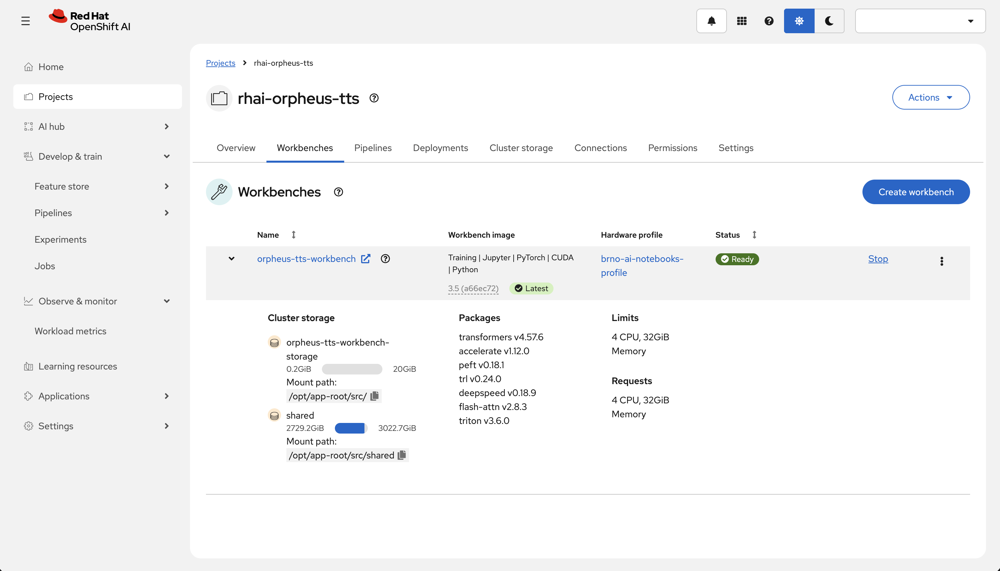

### 4. Clone the repository

In the workbench (terminal or **Git → Clone a Repository**):

```bash
git clone https://github.com/red-hat-data-services/red-hat-ai-examples.git
```

Open `examples/trainer/orpheus-tts/orpheus_tts_distributed.ipynb`:

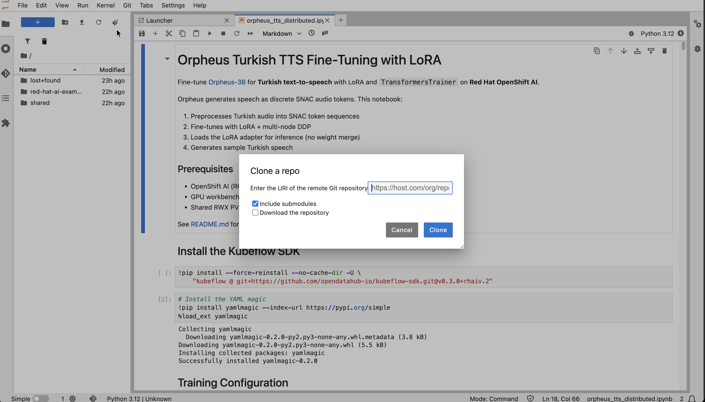

### 5. Edit notebook parameters

In the `%%yaml parameters` cell, set at least:

* `namespace` — your Data Science Project name

Optional for a quick smoke run: `max_train_samples: 2000`, `num_epochs: 1`. Use `max_train_samples: 0` for the full dataset.

## Run the notebook

Execute cells top to bottom:

1. Install the Kubeflow SDK and `yamlmagic`
2. Load parameters (`%%yaml parameters`)
3. Define `train_func` (must stay inline — `TransformersTrainer` serializes it with `inspect.getsource()`)
4. Authenticate with `OPENSHIFT_API_URL` + `NOTEBOOK_USER_TOKEN`
5. Submit the TrainJob
6. Monitor in **Develop & train → Jobs** and/or follow logs in the notebook
7. Resolve the LoRA path (`checkpoints/final` or latest `checkpoint-*`)
8. Generate Turkish speech in the workbench
9. Delete the TrainJob when finished (PVC artifacts remain)

## Monitor training

### Jobs dashboard

**Develop & train → Jobs** — select the TrainJob for live steps, epochs, and loss:

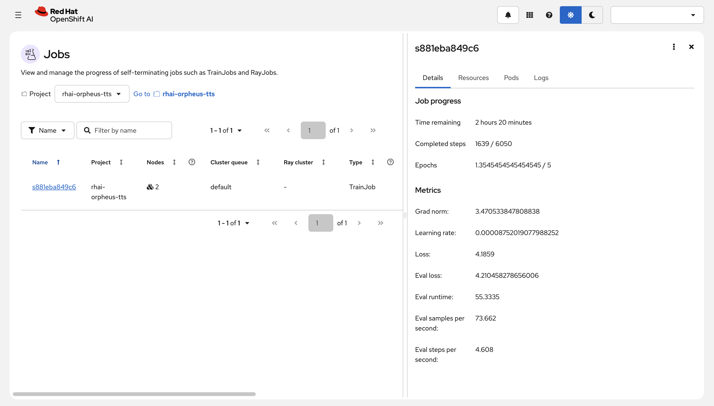

Job list and pod logs:

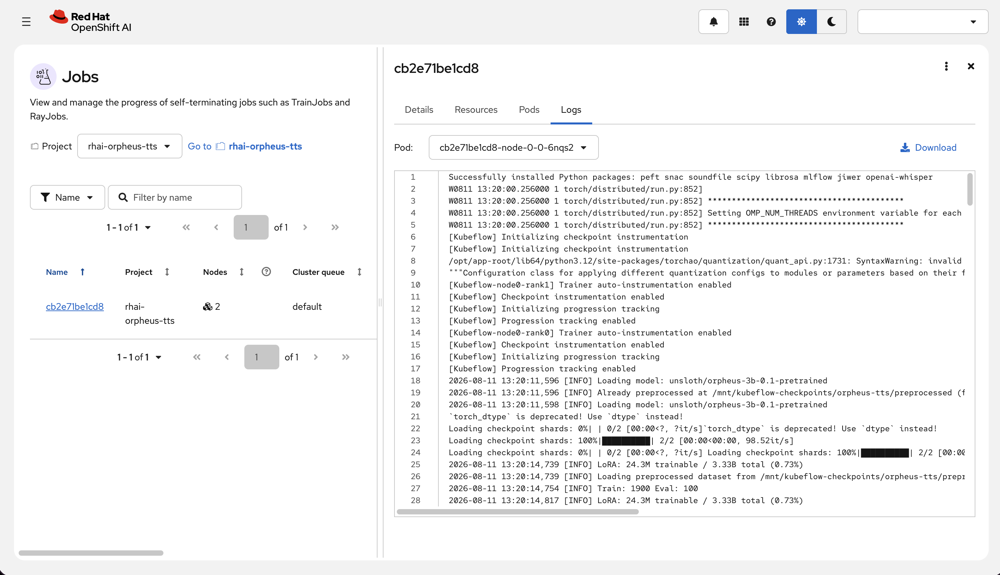

> [!TIP]
> Keep `get_job_logs(..., follow=True)` running until the job finishes. Pods are garbage-collected after backoff; durable logs also land under `shared/orpheus-tts/logs/`.

### Pause and resume

Use **Pause** on the job to free GPUs. JIT checkpointing writes state to the PVC so resume can continue:

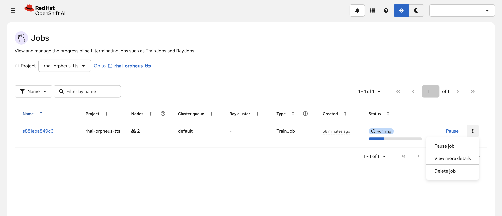

### Kueue admission

**Observe & monitor → Workload metrics** — confirm workloads are **Admitted**:

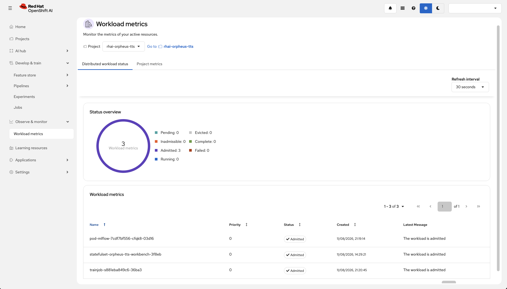

### TensorBoard

As an alternative to MLflow, TensorBoard can be used to monitor training metrics in real time directly from the workbench. The notebook includes a cell that starts TensorBoard and points it at the shared PVC checkpoint directory:

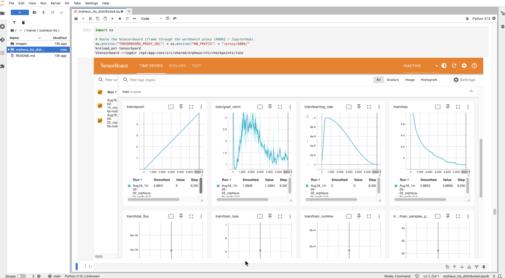

### MLflow experiment tracking

`train_func` logs training metrics, system resource usage, audio samples, and evaluation results to the RHOAI platform MLflow instance. See [MLflow integration](../../fine-tuning/mlflow.md) for setup and configuration.

**Model metrics** — loss, eval loss, learning rate, gradient norm, and real-time factor across all training steps:

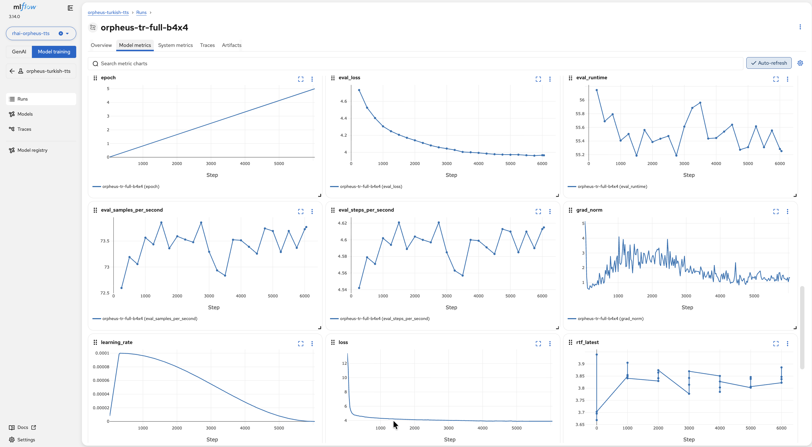

**System metrics** — per-GPU power draw, wattage, and utilization logged via `mlflow.enable_system_metrics_logging()` in `train_func`:

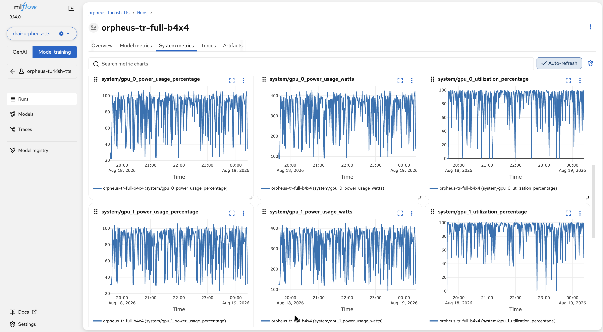

**Artifacts — evaluation table** — each eval step logs a JSON table with WER, CER, RTF, and Whisper transcriptions for each test sentence. LoRA adapter checkpoints are saved per epoch:

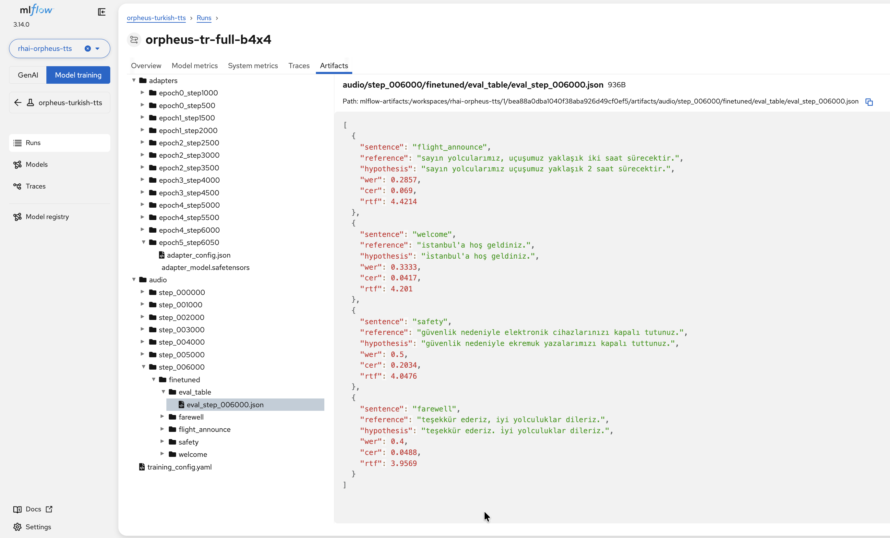

**Artifacts — audio samples** — generated Turkish speech WAVs are logged at configurable intervals and playable directly in the MLflow UI:

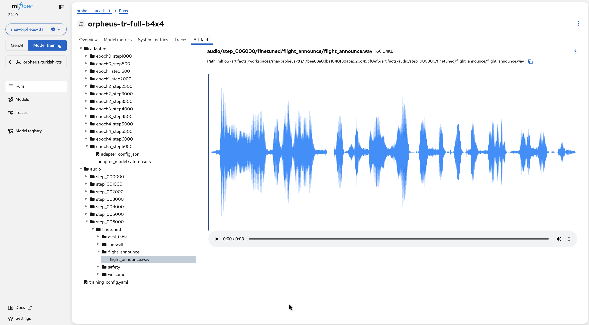

## Expected outcomes

After a successful run:

* LoRA adapter under `shared/orpheus-tts/checkpoints/final/` (or `checkpoint-*`)
* Preprocessed SNAC data and HF cache reused on later runs with the same fingerprint
* MLflow metrics, audio samples, and WER/CER logged to the RHOAI platform MLflow
* Playable speech from the generate cell in the workbench

### Example training charts

Illustrative loss and Whisper probe curves from a full-data multi-GPU run (your numbers will differ with hardware and hyperparameters):

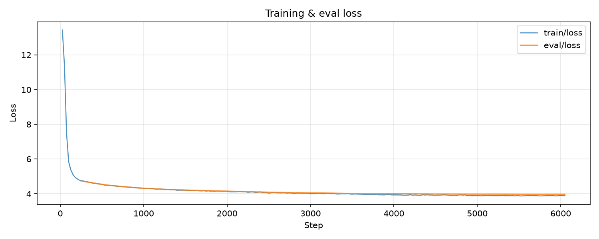

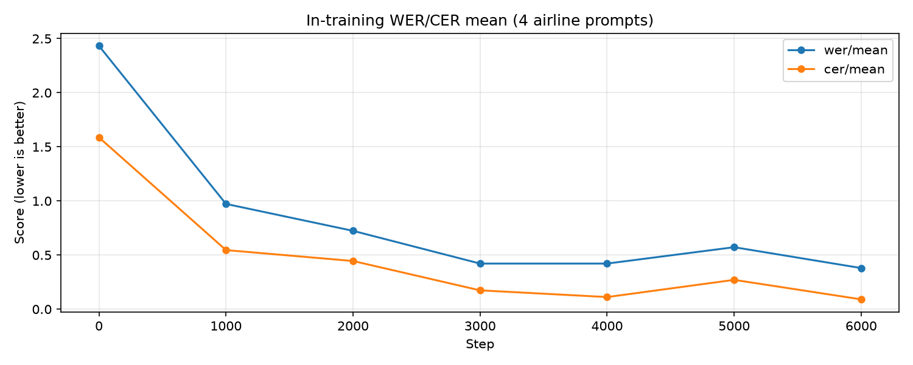

## Customization

| Parameter | Default | Description |
| --- | --- | --- |
| `namespace` | _(required)_ | Data Science Project / Kubernetes namespace |
| `mlflow_experiment` | `orpheus-turkish-tts` | MLflow experiment name |
| `max_train_samples` | `0` (full ~81K) | Cap training samples; `0` = full dataset |
| `num_nodes` | `2` | Distributed training nodes |
| `gpus_per_node` | `2` | GPUs per node |
| `batch_size` | `4` | Per-device batch size |
| `grad_accum` | `4` | Gradient accumulation steps |
| `num_epochs` | `5` | Training epochs |
| `learning_rate` | `1e-4` | AdamW learning rate |
| `lora_r` / `lora_alpha` / `lora_dropout` | `64` / `128` / `0.05` | LoRA settings |
| `save_steps` / `eval_steps` / `audio_log_steps` | `500` / `250` / `1000` | Checkpoint and logging cadence |

## Troubleshooting

### Permission denied on the shared PVC

Symptoms: `PermissionError` creating `shared/orpheus-tts/…` in the notebook, or `Permission denied: '/mnt/kubeflow-checkpoints/orpheus-tts'` in TrainJob logs.

`train_func` creates that tree at runtime. If it still fails, the volume is not writable by the project. Prefer an `fsGroup`-aware storage class, recreate the PVC, or have an admin grant the project supplemental group write access (`openshift.io/sa.scc.supplemental-groups`). Avoid world-writable (`o+w`) permissions.

### SNAC preprocessing is slow

First full-data encode can take tens of minutes on GPU (rank 0). Later runs skip work when a matching `.done-<hash>` sentinel exists on the PVC.

### Lost pod logs after failure

Pods are deleted after backoff. Check:

```text
shared/orpheus-tts/logs/rank0.log
shared/orpheus-tts/logs/rank0-FATAL.txt
```

### Job failed mid-training — does it start over?

No, if PVC artifacts remain:

| Artifact | Behavior on resubmit |
| --- | --- |
| `hf-cache/` | Reused |
| `preprocessed/` + matching `.done-<hash>` | Skipped |
| `checkpoints/checkpoint-*` | Auto-resumed |

Clear `preprocessed/` (and `.done-*`) if you change dataset/model revisions or preprocessing beyond the fingerprint fields. Clear checkpoints if you do not want to resume a different hyperparameter set.

### Out of memory during training

Lower `batch_size` (try `1`), then raise `grad_accum` if needed. Use larger-VRAM GPUs when possible.

### Out of memory during inference

Inference runs in the **workbench**. Use at least **32 GiB** workbench memory.

### MLflow connection errors

Training pods use the RHOAI platform MLflow at `https://mlflow.redhat-ods-applications.svc:8443/mlflow` with `kubernetes-namespaced` authentication. If pods get 403 errors, ensure the training service account has the `mlflow-operator-mlflow-integration` ClusterRole:

```bash
oc create rolebinding <name>-mlflow-integration \
  --clusterrole=mlflow-operator-mlflow-integration \
  --serviceaccount=<namespace>:default \
  -n <namespace>
```

To run without MLflow, set `report_to="none"` in `train_func`.

### NCCL / `/dev/shm` errors

With `gpus_per_node > 1`, NCCL needs more than the default 64 MiB `/dev/shm`. The notebook mounts a 1 GiB memory-backed volume. Keep that `shm_override` in the submit cell. For other NCCL issues, add `NCCL_DEBUG=INFO` to the trainer `env`.

### Generated audio is silent or garbled

* Confirm preprocess finished (matching `.done-<hash>` on the PVC)
* Confirm SNAC and `unsloth/orpheus-3b-0.1-pretrained` loaded correctly
* Keep generation `min_new_tokens` low (notebook default `28`) so end-of-audio can stop early

## References

* [Orpheus-TTS](https://github.com/canopyai/Orpheus-TTS)
* [SNAC](https://github.com/hubertsiuzdak/snac)
* [Kubeflow Trainer](https://www.kubeflow.org/docs/components/trainer/)
* [PEFT](https://github.com/huggingface/peft)
