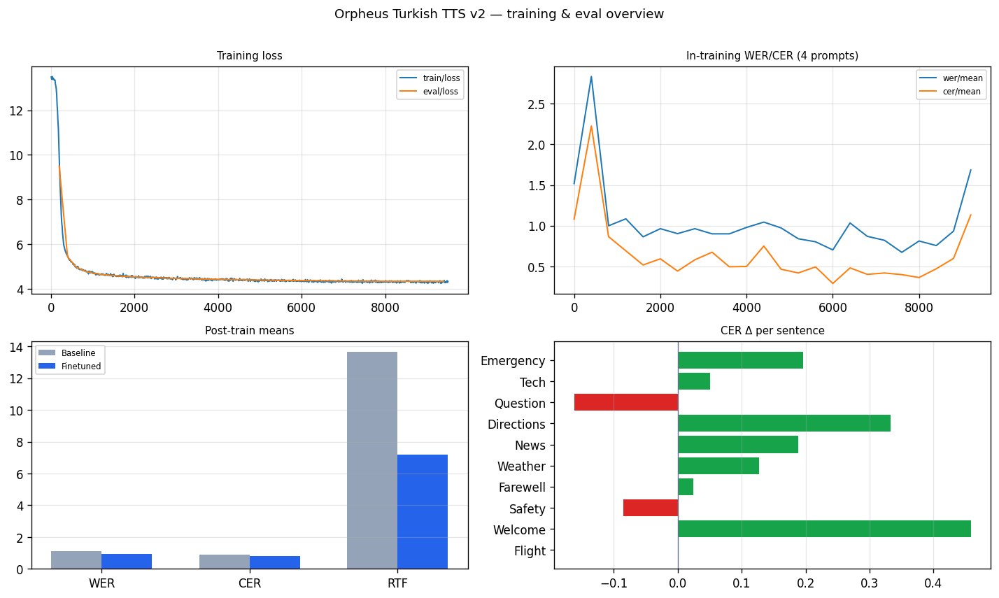

# Orpheus Turkish TTS Fine-Tuning with LoRA

Fine-tune [Orpheus-3B](https://huggingface.co/unsloth/orpheus-3b-0.1-pretrained) for **Turkish text-to-speech** using LoRA and the Kubeflow Trainer v2 `TransformersTrainer` SDK on Red Hat OpenShift AI.

## Overview

Orpheus-3B is a 3.3B-parameter codec language model built on Llama-3 that generates speech as discrete SNAC audio tokens. By default it only supports English. This example fine-tunes it on Turkish text-audio pairs so it produces intelligible Turkish speech.

The example demonstrates:

- **SNAC audio codec preprocessing** -- encoding raw audio into interleaved codec token sequences (rank 0, inside the TrainJob)
- **LoRA fine-tuning** via `TransformersTrainer` -- distributed across multiple nodes with PyTorch DDP
- **Audio-only loss masking** -- cross-entropy computed only on audio token positions
- **MLflow tracking** -- loss, in-training WAV samples, and Whisper WER/CER
- **Post-training inference** -- merging LoRA and generating Turkish speech in the workbench

### How it works

```text
Turkish text
      |
      v
 Llama-3 Tokenizer
      |
      v
 Orpheus-3B (3.3B params, LoRA r=16)
      |
      v
 Token stream: [SOH] text [EOT][EOH][SOA][SOS] audio_tokens [EOA]
      |
      v
 SNAC Decoder (24kHz)
      |
      v
 Audio waveform
```

Each training sample interleaves text BPE tokens with SNAC codec tokens (7 per audio frame across 3 codebooks). The model learns to generate audio conditioned on text input, with text positions masked from the loss.

### Model and dataset

| Component | Details |
|-----------|---------|
| **Base model** | [unsloth/orpheus-3b-0.1-pretrained](https://huggingface.co/unsloth/orpheus-3b-0.1-pretrained) (3.3B, Llama-3 backbone) |
| **Audio codec** | [hubertsiuzdak/snac_24khz](https://huggingface.co/hubertsiuzdak/snac_24khz) |
| **Dataset** | [afkfatih/turkish-tts-combined-raw](https://huggingface.co/datasets/afkfatih/turkish-tts-combined-raw) (~81K text-audio pairs) |
| **Fine-tuning method** | LoRA (r=16, alpha=32) on attention + MLP projections |

## Prerequisites

- OpenShift AI (RHOAI) 3.2+ with Kubeflow Trainer v2 enabled
- A workbench with **GPU** (required for LoRA merge and inference)
- GPU worker nodes for distributed training (A100 recommended)
- A shared PVC with **ReadWriteMany (RWX)** access mode
  - **Suggested size**: 150Gi (base model ~7GB, SNAC model ~200MB, preprocessed dataset, checkpoints)
- Optional: MLflow tracking server reachable from training pods (platform MLflow, or an in-namespace server at `http://mlflow.<namespace>.svc.cluster.local:5000`)

## Hardware requirements

### Workbench requirements

| Image Type | GPU | CPU | Memory | Notes |
|------------|-----|-----|--------|-------|
| Training \| Jupyter \| PyTorch \| CUDA \| Python | 1x GPU | 4 cores | 32Gi | Required for LoRA merge and post-training inference |

### Training job requirements

| Component | Configuration | GPU per node | Total GPU | CPU | Memory |
|-----------|--------------|---|---|-----|--------|
| Training pods | 2 nodes x 1 GPU | 1 | 2 | 4 cores/pod | 32Gi/pod |

> **Note:** This example was tested on 2 x A100-80GB. It will work on other Ampere+ GPUs (L40S, H100) with adjusted batch size. For GPUs with less than 40GB VRAM, reduce `batch_size` to 1 or increase `grad_accum`.

### Storage requirements

| Purpose | Size | Access Mode | Notes |
|---------|------|-------------|-------|
| Shared PVC (`shared`) | 150Gi | RWX | HF cache, preprocessed data, checkpoints, merged model |

Layout on the PVC (workbench mount `/opt/app-root/src/shared`, TrainJob mount `/mnt/kubeflow-checkpoints`):

```text
shared/orpheus-tts/
  hf-cache/
  preprocessed/          # versioned sentinel .done-<hash>
  checkpoints/           # TrainJob output_dir
  final/                 # merged model (workbench cell)
```

## Setup

### Create a workbench

1. In the OpenShift AI dashboard, go to **Data Science Projects** and create or select a project.
2. Create a workbench with the **Training | Jupyter | PyTorch | CUDA | Python** image.
3. Attach a GPU hardware profile (**4 CPU / 32Gi memory / 1 GPU** recommended).
4. Create a shared **RWX PVC** named `shared` (150Gi recommended) and attach it to the workbench at `/opt/app-root/src/shared`.

### Clone and open the notebook

From the workbench terminal:

```bash
git clone https://github.com/red-hat-data-services/red-hat-ai-examples.git
```

Navigate to `examples/trainer/orpheus-tts` and open `orpheus_tts_distributed.ipynb`.

### Edit configuration

In the `%%yaml parameters` cell, set at least:

- `namespace` — your Data Science Project name
- `mlflow_experiment` — experiment name for tracking

## Usage

The notebook walks you through the full workflow:

1. **Install dependencies** — Kubeflow SDK + `yamlmagic`
2. **Configure parameters** — `%%yaml parameters` (infrastructure, LoRA, training, logging)
3. **Define `train_func`** — self-contained training logic (must be inline; `TransformersTrainer` serializes via `inspect.getsource()`)
4. **Authenticate** — `TrainerClient` via `NOTEBOOK_USER_TOKEN` or the workbench service-account token
5. **Submit distributed training** — `TransformersTrainer` with DDP, periodic + JIT checkpointing, progression tracking, MLflow env
6. **Monitor training** — stream logs; inspect metrics/artifacts in MLflow
7. **Merge LoRA adapter** — combine adapter weights into a standalone model on the shared PVC
8. **Generate Turkish speech** — run inference and listen to audio in the notebook
9. **Cleanup** — delete the training job

> **Note:** `train_orpheus.py` is an optional CLI companion for local/scripted runs. The notebook does **not** import it — all TrainJob logic lives inside `train_func`.

## Expected outcomes

After training completes:

- A merged model at `<PVC>/orpheus-tts/final/` capable of generating Turkish speech
- Training checkpoints at `<PVC>/orpheus-tts/checkpoints/`
- MLflow runs with loss curves, audio samples, and WER/CER (when a tracker is configured)
- Generated audio samples playable in the notebook

With 2,000 training samples and 3 epochs, expect noticeably improved Turkish intelligibility compared to the English-only pretrained model. For production quality, increase `max_train_samples` to 20,000+, `num_epochs` to 8, and use `lora_r: 32` / `lora_alpha: 64`.

### Reference results (20K samples, 8 epochs, 2× A100-80GB)

Post-training evaluation comparing English-only base against the fine-tuned Turkish model, scored with Whisper-small ASR:

| Metric | Baseline | Fine-tuned | Δ |
|--------|----------|------------|---|
| **WER mean** | 1.576 | **0.723** | −0.854 |
| **CER mean** | 1.224 | **0.410** | −0.814 |
| **eval_loss** | 9.50 | **4.35** | −5.15 |


**In-training WER/CER** — measured on 4 Turkish sentences every 400 steps:


**Full MLflow dashboard** — loss, WER/CER, and per-sentence CER improvement:



**Per-sentence WER & CER** — baseline (grey) vs fine-tuned (blue/green):


See the [HuggingFace model card](https://huggingface.co/AbDhumal/orpheus-3b-turkish-tts-v2) for audio samples and MLflow traces.

## Customization

Edit the `%%yaml parameters` cell (passed to `train_func` as `func_args`):

| Parameter | Default | Description |
|-----------|---------|-------------|
| `namespace` | _(edit)_ | OpenShift AI project / Kubernetes namespace |
| `mlflow_experiment` | `orpheus-turkish-tts` | MLflow experiment name |
| `max_train_samples` | 2000 | Training samples (0 = full ~81K dataset) |
| `num_nodes` | 2 | Distributed training nodes |
| `gpus_per_node` | 1 | GPUs per training node |
| `batch_size` | 4 | Per-device batch size (gradient checkpointing enables larger batches) |
| `grad_accum` | 2 | Gradient accumulation steps |
| `num_epochs` | 3 | Training epochs |
| `learning_rate` | 1e-4 | AdamW learning rate (LoRA typically 1e-4–2e-4) |
| `lora_r` | 16 | LoRA rank (production run used 32) |
| `lora_alpha` | 32 | LoRA alpha (production run used 64) |
| `lora_dropout` | 0 | LoRA dropout |
| `save_steps` | 200 | Checkpoint cadence (auto-aligned to a multiple of `eval_steps`) |
| `eval_steps` | 100 | Loss evaluation cadence |
| `audio_log_steps` | 500 | In-training wav + Whisper cadence (keep sparse) |

## Troubleshooting

### SNAC preprocessing is slow

SNAC encoding runs on GPU inside the TrainJob (rank 0). For large datasets (>10K samples), the first run may take 15–30 minutes. Subsequent runs skip preprocessing when a matching versioned `.done-<hash>` sentinel exists on the PVC.

### Permission denied on the shared PVC

Some NFS storage classes provision volumes as `root:<fixed-gid>` with mode `755`. Training pods then cannot write. Ensure the PVC root (or `orpheus-tts/`) is group/world-writable for your namespace UIDs, or use a storage class that respects `fsGroup`.

### Out of memory during training

Reduce `batch_size` to 1 and increase `grad_accum` to maintain the same effective batch size. Alternatively, use GPUs with more VRAM.

### Out of memory during LoRA merge / inference

Merge and generate run in the **workbench**, not the TrainJob. Use at least **32Gi** workbench memory (see hardware profile limits).

### MLflow connection errors

Training pods use `MLFLOW_TRACKING_URI` from the workbench env when set; otherwise they fall back to `http://mlflow.<namespace>.svc.cluster.local:5000`. Point the workbench (or trainer `env`) at a reachable tracker, or temporarily set `report_to="none"` in `train_func` for a smoke run.

### NCCL errors

```bash
oc logs <pod-name> -c node | grep -i "nccl"
```

Ensure all training nodes can communicate on the required ports. Add `NCCL_DEBUG=INFO` to the trainer `env` dict for diagnostics.

### Generated audio is silent or garbled

- Verify the preprocessed dataset has a matching `.done-<hash>` sentinel on the PVC
- Check that the SNAC model was downloaded correctly
- Ensure the base model is `unsloth/orpheus-3b-0.1-pretrained` (Llama-3 vocab, not Llama-2)

## References

- [Orpheus-TTS](https://github.com/canopyai/Orpheus-TTS) -- Lacombe & Kumar, 2025
- [SNAC: Multi-Scale Neural Audio Codec](https://github.com/hubertsiuzdak/snac) -- Siuzdak, 2024
- [Kubeflow Trainer v2](https://github.com/kubeflow/trainer) -- TrainJob API
- [PEFT: Parameter-Efficient Fine-Tuning](https://github.com/huggingface/peft) -- HuggingFace
